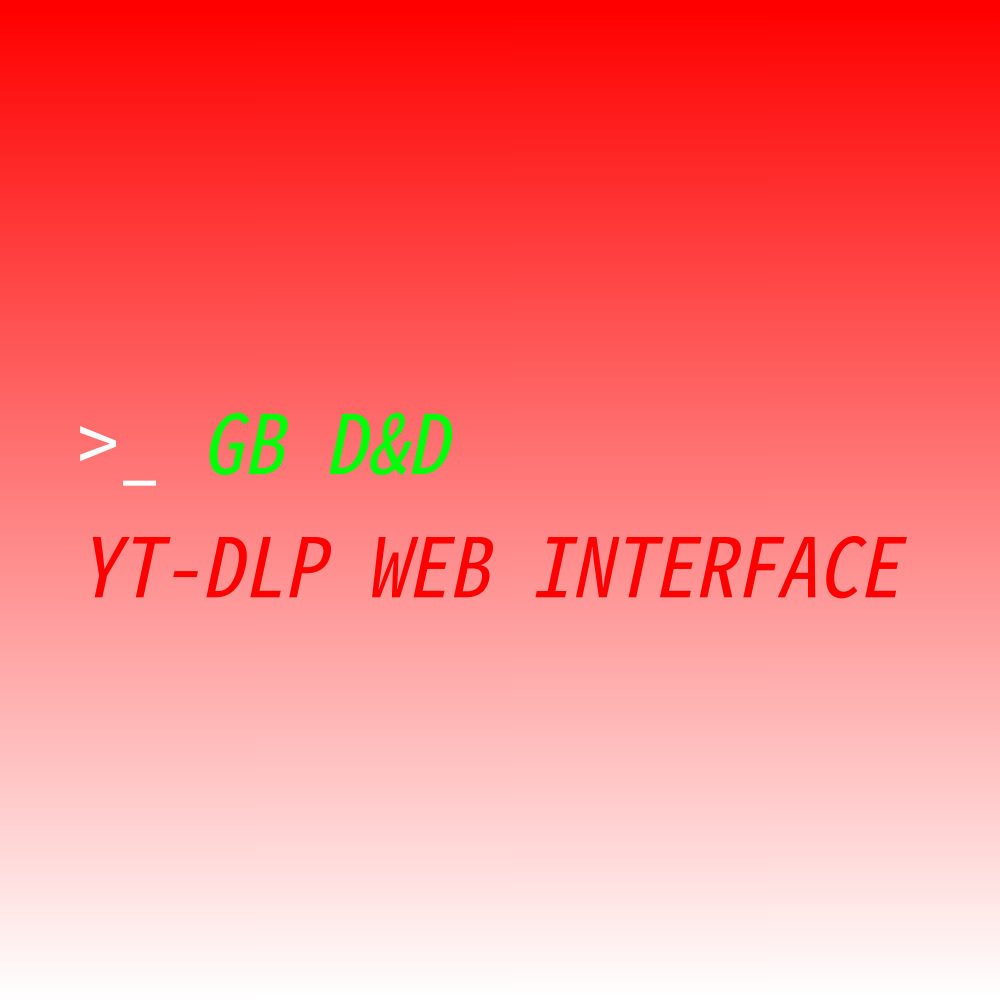

# GlobBruh YT-DLP Download and Delete

## Preface:

This is a website built with PHP designed to provide a simple-to-use frontend for [YT-DLP](https://github.com/yt-dlp/yt-dlp). Its built for low-capacity systems and designed for temporary viewing and downloading of media. 

Check out YT-DLP [here](https://github.com/yt-dlp/yt-dlp).

A list of supported websites can be found [here](https://github.com/yt-dlp/yt-dlp/blob/master/supportedsites.md).

## Setup:

Copy website files to web server. 

YT-DLP must be accessible at the path `./ytdlp/bin/yt-dl`. Its recommended you use `python3-venv` and `pip3` to achieve this. 

An upload folder must be created at `./upload/`.

ensure `www-data` has permission to execute YT-DLP and has permission to write to `./upload/`.

Use of YT-DLP with FFMPEG is not supported.

Use extreme caution when forwarding to the internet. The site doesn't log downloads and has not been security tested. If logging is needed, please set it up using your site configurations.